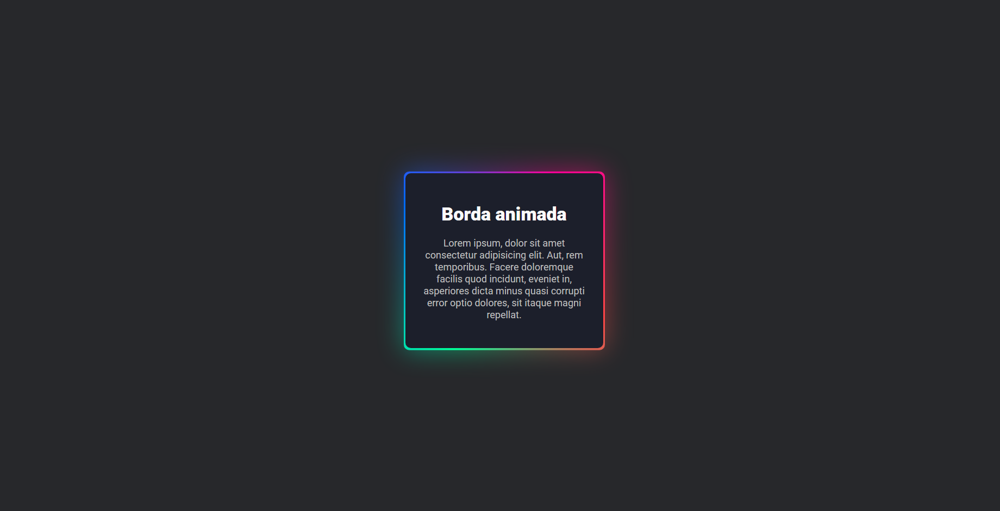

# Borda animada em css

esbarrei nesse conteudo por acaso e queria muito ver como ficaria, créditos ao tutorial do [Codign2GO](https://youtu.be/ezP4kbOvs_E?si=FF7zpP3K-7HlBp1n), em poucos minutos consegui fazer esse efeito muito legal

## imagem de como ficou
 

mechendo na propriedade background-image, da pra fazer varias variações legais:

background-image: conic-gradient(from var(--angle),#ff4545 0 35%, transparent 35% 40%, #45ffaf 40% 70%,  transparent 70% 75%, #006aff 75% 95%, transparent 95% 100%);

ou

background-image: conic-gradient(from var(--angle), transparent 50%,#ff4545);

entre varias outras...

### alterando as propriedades da classe da pra fazer um hover estatico ou animado

#### estatico:

``` css
    .card:hover::after, .card:hover::before{
    content:  '';
    position: absolute;
    height: 100%;
    width: 100%;
    background-image: conic-gradient(#ff4545, #4545ff, #ff4545);
    top: 50%;
    left: 50%;
    translate: -50% -50%;
    z-index: -1;
    padding: 3px;
    border-radius: 10px;
    animation: 3s spin linear infinite;
}
```

#### animado:

``` css 
    .card:hover::after, .card:hover::before{
    content:  '';
    position: absolute;
    height: 100%;
    width: 100%;
    background-image: conic-gradient(from var(--angle), #ff4545, #4545ff, #ff4545);
    top: 50%;
    left: 50%;
    translate: -50% -50%;
    z-index: -1;
    padding: 3px;
    border-radius: 10px;
    animation: 3s spin linear infinite;
}
```